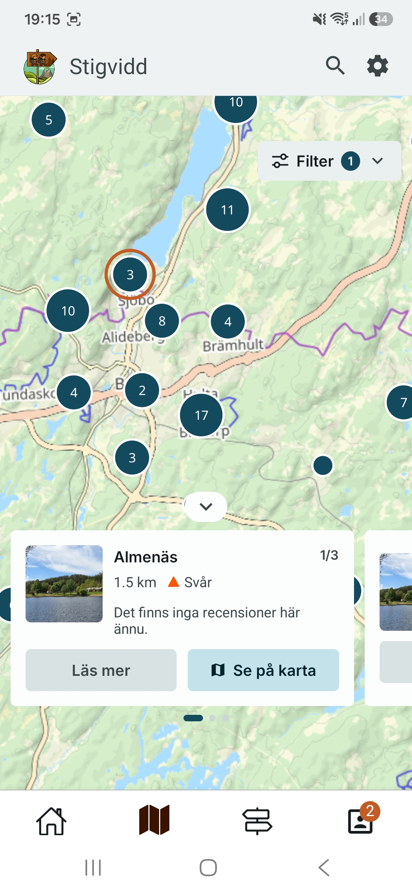
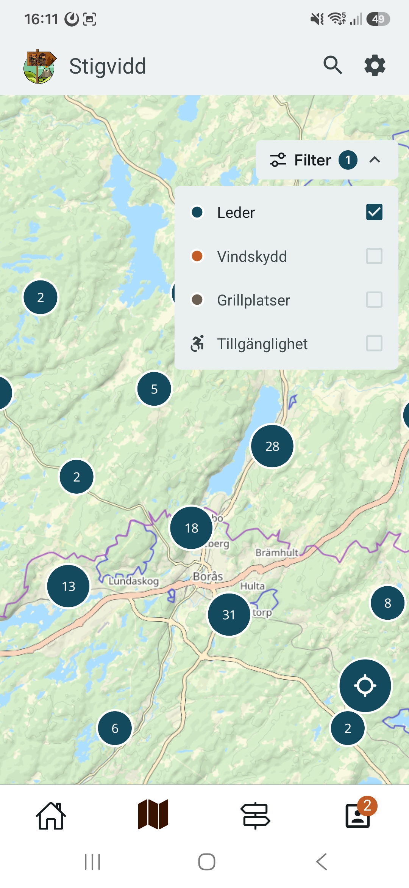

# Stigvidd

Stigvidd is a full-stack hiking and trail discovery application built as a thesis project. It lets users explore hiking trails in the Borås area, record their own hikes with GPS tracking, rate and review trails, and report obstacles along the way.

The project consists of three parts: a cross-platform mobile app, a web-based admin dashboard, and a REST API backend.

<figure>
  
</figure>

---

## Screenshots

<table>
  <tr>
    <td align="center"><b>Login</b></td>
    <td align="center"><b>Start screen</b></td>
    <td align="center"><b>Profile</b></td>
    <td align="center"><b>Favorites</b></td>
  </tr>
  <tr>
    <td></td>
    <td></td>
    <td></td>
    <td></td>
  </tr>
  <tr>
    <td align="center"><b>Trail detail</b></td>
    <td align="center"><b>Trail info & obstacles</b></td>
    <td align="center"><b>Practical info</b></td>
    <td align="center"><b>Trail list</b></td>
  </tr>
  <tr>
    <td></td>
    <td></td>
    <td></td>
    <td></td>
  </tr>
  <tr>
    <td align="center"><b>Map overview</b></td>
    <td align="center"><b>Map filter</b></td>
    <td></td>
    <td></td>
  </tr>
  <tr>
    <td></td>
    <td></td>
    <td></td>
    <td></td>
  </tr>
</table>

---

## Architecture

```
stigvidd/
├── app/          # Mobile app (React Native / Expo)
├── web/          # Admin dashboard (React / Vite)
├── backend/      # REST API + domain logic (ASP.NET Core / C#)
│   ├── StigviddAPI/        # Controllers, middleware, startup
│   ├── Core/               # Services, validators, factories
│   ├── Infrastructure/     # EF Core entities, DbContext, migrations
│   ├── WebDataContracts/   # Request/response DTOs
│   ├── MapData/            # GeoJSON/CSV import ETL tool (see below)
│   └── Tests/              # Unit and integration tests
```

---

## Tech Stack

### Mobile App

- React Native with Expo (SDK 54)
- TypeScript
- Expo Router (file-based routing)
- MapLibre Native + MapTiler "Outdoor" vector tiles, with Expo Location (GPS tracking)
- TanStack Query (server state) + Jotai (global state)
- React Hook Form + Zod (form validation)
- React Native Paper (Material Design 3)
- Expo Notifications (push notifications)
- i18next / react-i18next (Swedish + English, in progress — not yet user-facing)

### Admin Dashboard

- React 19 with Vite
- TypeScript
- React Router v7
- Tailwind CSS v4
- Keycloak (JWT / OpenID Connect)

### Backend

- ASP.NET Core 10 (Web API)
- C# / .NET 10
- Entity Framework Core 10 with PostgreSQL + PostGIS
- Keycloak (JWT / OpenID Connect)
- FluentValidation with auto-validation middleware
- WebDAV for image file storage
- NSwag / Swagger for API docs

---

## Features

- Browse and filter hiking trails (difficulty, accessibility, length, distance, city)
- Interactive map with trail markers and GPS coordinates
- Background GPS tracking during hikes with distance calculation
- Trail reviews with star ratings and photos
- Favorites and wishlist with optimistic UI updates
- Report trail obstacles/hazards with a voting system
- Share completed hikes with other users
- Push notifications
- User profiles with hike history
- Admin dashboard for trail management

> **In progress:** Swedish/English language support (i18n) is being built but not yet user-facing.

---

## MapData – Import Tool

`backend/MapData` is a C# console application that imports geographic data from Borås municipality's open data portal into the database. It contains two separate ETL (Extract, Transform, Load) parsers:

- **`TransmogrifyBorasData`** — imports trail data from a GeoJSON file (`spar_leder.json`)
- **`FacilityImporter`** — imports facility data (grill sites, wind shelters) from a CSV file

Both parsers:

1. **Extract** the source data from the municipality-provided file
2. **Transform** the data:
   - Parse Swedish property names and values (`"lätt"/"medel"/"svår"` → Classification enum)
   - Convert Swedish decimal format (`"2,3 km"` → decimal)
   - Swap GeoJSON coordinate order (`[longitude, latitude]` → `{latitude, longitude}`)
   - Map accessibility values (`"JA"/"NEJ"` → bool)
   - Handle missing and null fields gracefully
3. **Load** the transformed entities into PostgreSQL (PostGIS) via Entity Framework Core

To run an import, place the source file in the expected path and run the `MapData` project. Connection string is configured via .NET user secrets.

---

## Getting Started

### Prerequisites

- Node.js 20+
- .NET 10 SDK
- PostgreSQL with the PostGIS extension (local or remote)
- A Keycloak realm (for backend, mobile app and admin dashboard authentication)
- A MapTiler API key and style id (for map tiles in the mobile app)
- Expo Go app or Android/iOS emulator

---

### Backend

1. Navigate to the API project:

   ```bash
   cd backend/StigviddAPI
   ```

2. Set up user secrets with your connection string:

   ```bash
   dotnet user-secrets set "ConnectionStrings:StigVidd" "your_connection_string"
   ```

3. Configure your Keycloak realm settings (`Keycloak` and `KeycloakAdminClient` sections) in `appsettings.json` or user secrets.

4. Apply database migrations:

   ```bash
   dotnet ef database update --project ../Infrastructure
   ```

5. Run the API:
   ```bash
   dotnet run
   ```

The API will be available at `https://localhost:7xxx`. Swagger UI is available at `/swagger`.

---

### Mobile App

1. Navigate to the app directory:

   ```bash
   cd app
   ```

2. Install dependencies:

   ```bash
   npm install
   ```

3. Create a `.env` file with your API, Keycloak and MapTiler config:

   ```
   EXPO_PUBLIC_API_HOST=https://localhost:7xxx
   EXPO_PUBLIC_OIDC_URL=https://your-keycloak-host/auth
   EXPO_PUBLIC_OIDC_REALM=stigvidd
   EXPO_PUBLIC_CLIENT_ID=...
   EXPO_PUBLIC_MAPTILER_API_KEY=...
   EXPO_PUBLIC_MAPTILER_STYLE_ID=...
   ```

4. Start the development server:
   ```bash
   npx expo start
   ```

---

### Admin Dashboard

1. Navigate to the web directory:

   ```bash
   cd web
   ```

2. Install dependencies:

   ```bash
   npm install
   ```

3. Create a `.env` file with your Keycloak config:

   ```
   VITE_OIDC_URL=https://your-keycloak-host/auth
   VITE_OIDC_REALM=stigvidd
   VITE_CLIENT_ID=...
   ```

4. Start the development server:
   ```bash
   npm run dev
   ```

---

## Authentication

Authentication is handled by Keycloak. The mobile app and admin dashboard obtain a JWT from Keycloak on login (OpenID Connect), which is passed as a Bearer token in API requests. The backend validates incoming tokens against the Keycloak realm via `AddKeycloakWebApiAuthentication`.

---

## Data Source

Trail and facility data (grill sites, wind shelters) for the Borås area is sourced from [Borås Stad's open data portal](https://www.boras.se) in GeoJSON/CSV format and imported using the `MapData` ETL tool.
