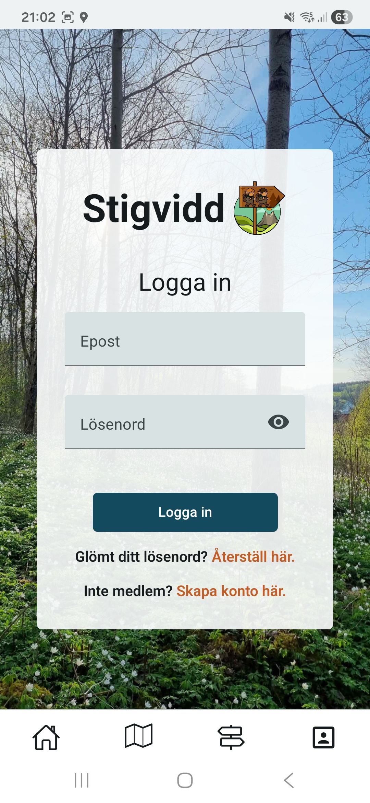
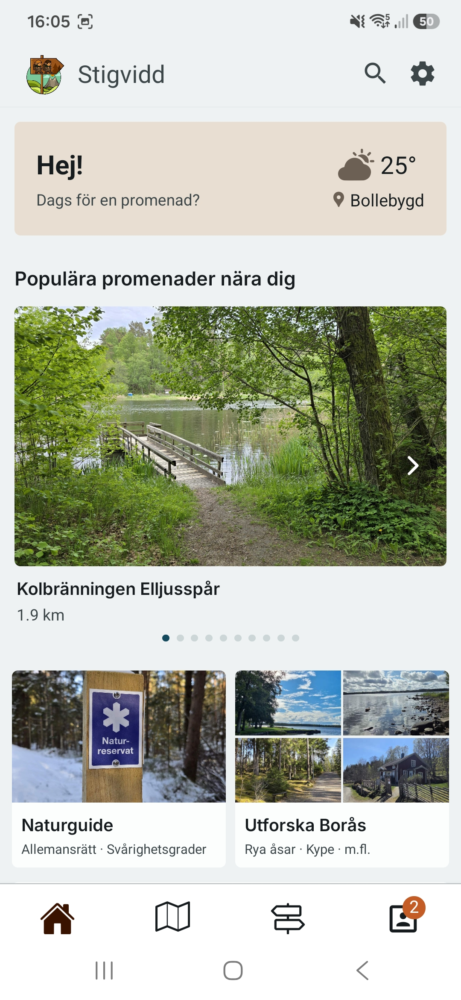
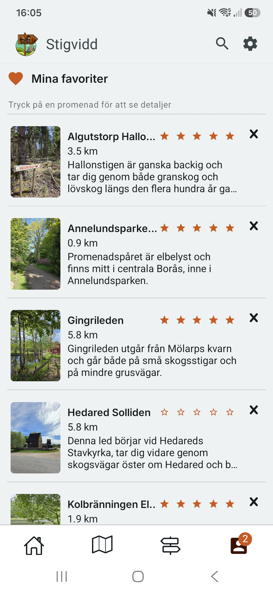
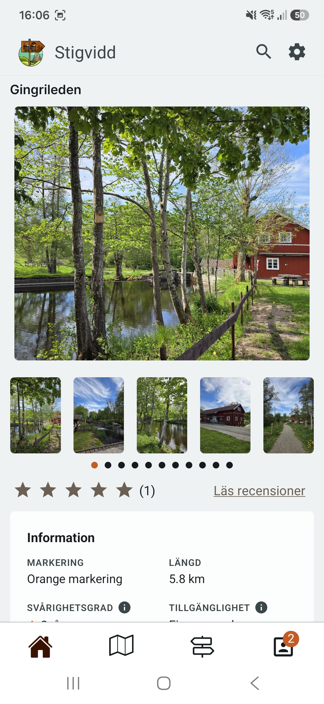
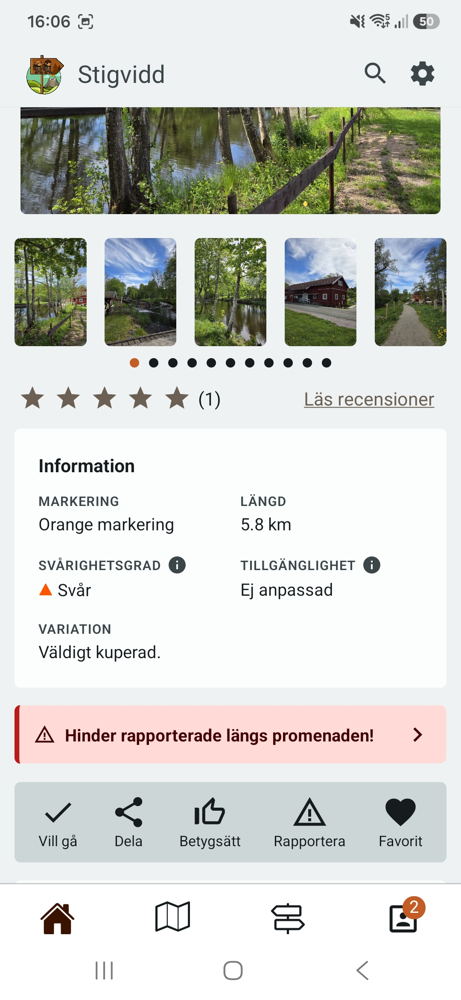
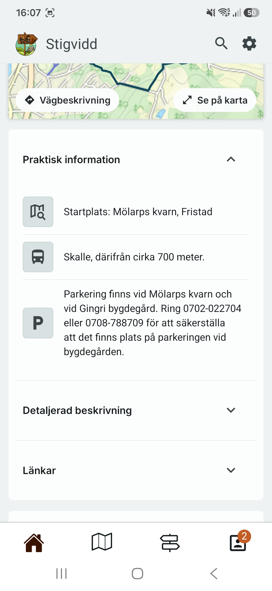
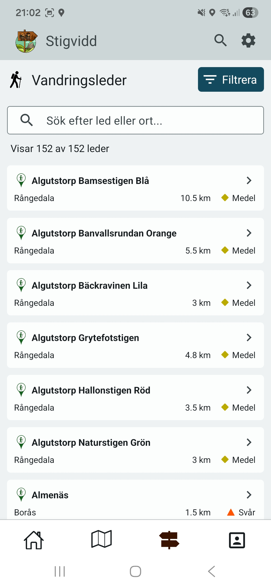

# Stigvidd

Stigvidd is a full-stack hiking and trail discovery application built as a thesis project. It lets users explore hiking trails in the Borås area, record their own hikes with GPS tracking, rate and review trails, and report obstacles along the way.

The project consists of three parts: a cross-platform mobile app, a web-based admin dashboard, and a REST API backend.

<figure>
  
</figure>

---

## Screenshots

<table>
  <tr>
    <td align="center"><b>Login</b></td>
    <td align="center"><b>Start screen</b></td>
    <td align="center"><b>Profile</b></td>
    <td align="center"><b>Favorites</b></td>
  </tr>
  <tr>
    <td></td>
    <td></td>
    <td></td>
    <td></td>
  </tr>
  <tr>
    <td align="center"><b>Trail detail</b></td>
    <td align="center"><b>Trail info & obstacles</b></td>
    <td align="center"><b>Practical info</b></td>
    <td align="center"><b>Trail list</b></td>
    <td></td>
  </tr>
  <tr>
    <td></td>
    <td></td>
    <td></td>
    <td></td>
    <td></td>
  </tr>
</table>

---

## Architecture

```
stigvidd/
├── app/          # Mobile app (React Native / Expo)
├── web/          # Admin dashboard (React / Vite)
├── backend/      # REST API + domain logic (ASP.NET Core / C#)
│   ├── StigviddAPI/        # Controllers, middleware, startup
│   ├── Core/               # Services, validators, factories
│   ├── Infrastructure/     # EF Core entities, DbContext, migrations
│   ├── WebDataContracts/   # Request/response DTOs
│   └── MapData/            # GeoJSON ETL tool (see below)
```

---

## Tech Stack

### Mobile App

- React Native with Expo (SDK 54)
- TypeScript
- Expo Router (file-based routing)
- React Native Maps + Expo Location (GPS tracking)
- TanStack Query (server state) + Jotai (global state)
- React Hook Form + Zod (form validation)
- React Native Paper (Material Design 3)

### Admin Dashboard

- React 19 with Vite
- TypeScript
- React Router v7
- Tailwind CSS v4

### Backend

- ASP.NET Core 10 (Web API)
- C# / .NET 10
- Entity Framework Core 10 with SQL Server
- Firebase Authentication (JWT)
- FluentValidation with auto-validation middleware
- WebDAV for image file storage
- NSwag / Swagger for API docs

---

## Features

- Browse and filter hiking trails (difficulty, accessibility, length, distance, city)
- Interactive map with trail markers and GPS coordinates
- Background GPS tracking during hikes with distance calculation
- Trail reviews with star ratings and photos
- Favorites and wishlist with optimistic UI updates
- Report trail obstacles/hazards with a voting system
- User profiles with hike history
- Admin dashboard for trail management

---

## MapData – GeoJSON Import Tool

`backend/MapData` is a C# console application that imports trail data from Borås municipality's open data portal into the database. It is an ETL (Extract, Transform, Load) pipeline that:

1. **Extracts** trail data from a GeoJSON file (`spar_leder.json`) provided by Borås municipality
2. **Transforms** the data:
   - Parses Swedish property names and values (`"lätt"/"medel"/"svår"` → Classification enum)
   - Converts Swedish decimal format (`"2,3 km"` → decimal)
   - Swaps GeoJSON coordinate order (`[longitude, latitude]` → `{latitude, longitude}`)
   - Maps accessibility values (`"JA"/"NEJ"` → bool)
   - Handles missing and null fields gracefully
3. **Loads** the transformed trail entities into SQL Server via Entity Framework Core

To run the import, place `spar_leder.json` in the expected path and run the `MapData` project. Connection string is configured via .NET user secrets.

---

## Getting Started

### Prerequisites

- Node.js 20+
- .NET 10 SDK
- SQL Server (local or remote)
- Firebase project with Authentication enabled
- Google Maps API key (Android)
- Expo Go app or Android/iOS emulator

---

### Backend

1. Navigate to the API project:

   ```bash
   cd backend/StigviddAPI
   ```

2. Set up user secrets with your connection string:

   ```bash
   dotnet user-secrets set "ConnectionStrings:StigVidd" "your_connection_string"
   ```

3. Apply database migrations:

   ```bash
   dotnet ef database update --project ../Infrastructure
   ```

4. Run the API:
   ```bash
   dotnet run
   ```

The API will be available at `https://localhost:7xxx`. Swagger UI is available at `/swagger`.

---

### Mobile App

1. Navigate to the app directory:

   ```bash
   cd app
   ```

2. Install dependencies:

   ```bash
   npm install
   ```

3. Create a `.env` file with your Firebase and API config:

   ```
   EXPO_PUBLIC_API_URL=https://localhost:7xxx
   EXPO_PUBLIC_FIREBASE_API_KEY=...
   EXPO_PUBLIC_FIREBASE_AUTH_DOMAIN=...
   EXPO_PUBLIC_FIREBASE_PROJECT_ID=...
   EXPO_PUBLIC_FIREBASE_APP_ID=...
   GOOGLE_MAPS_API_KEY=...
   ```

4. Start the development server:
   ```bash
   npx expo start
   ```

---

### Admin Dashboard

1. Navigate to the web directory:

   ```bash
   cd web
   ```

2. Install dependencies:

   ```bash
   npm install
   ```

3. Start the development server:
   ```bash
   npm run dev
   ```

---

## Authentication

Authentication is handled by Firebase. The mobile app and web client obtain a JWT from Firebase on login, which is passed as a Bearer token in API requests. The backend validates the token against Google's secure token endpoint for the Firebase project.

---

## Data Source

Trail data for the Borås area is sourced from [Borås Stad's open data portal](https://www.boras.se) in GeoJSON format and imported using the `MapData` ETL tool.
