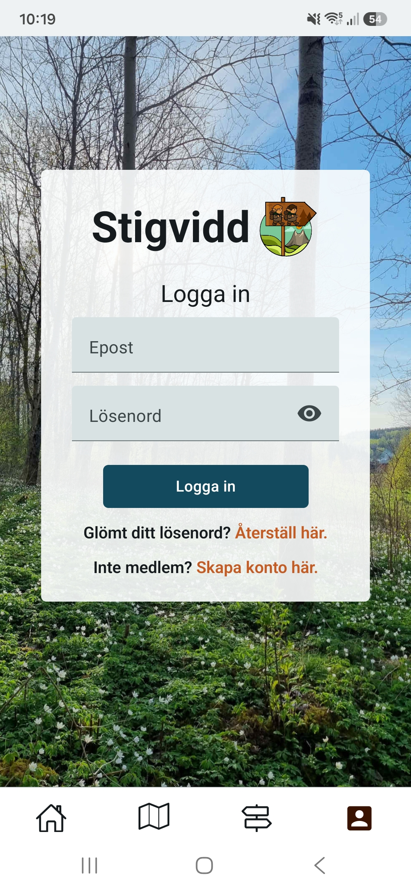
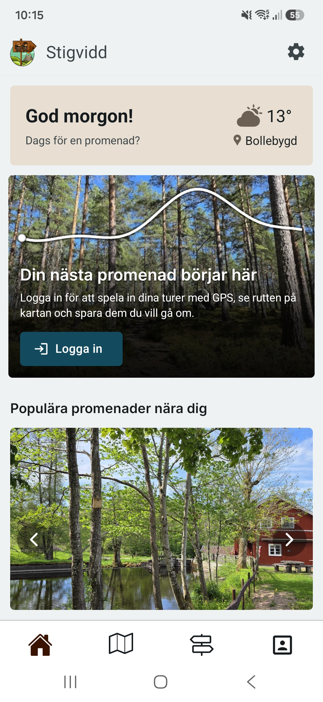
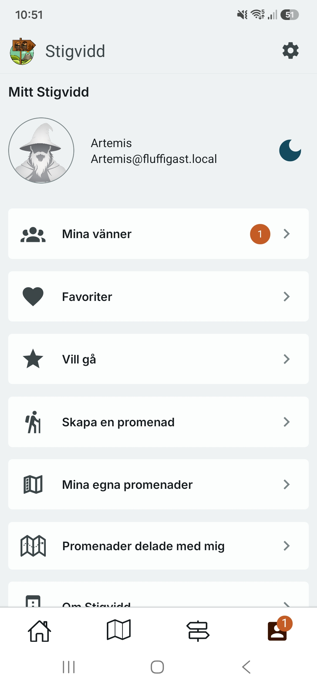
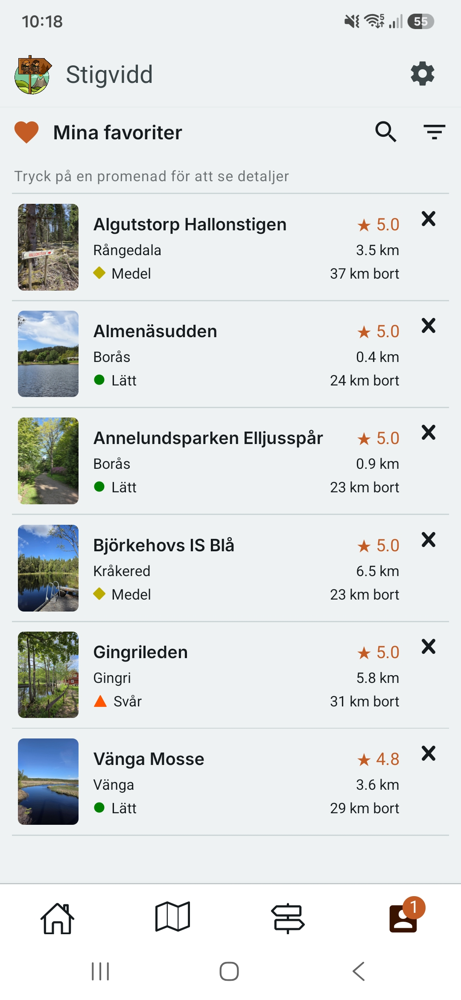
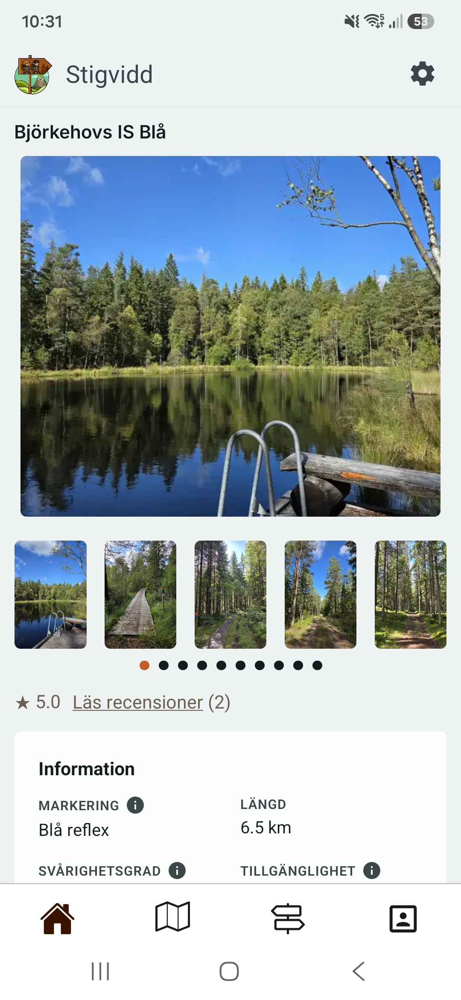
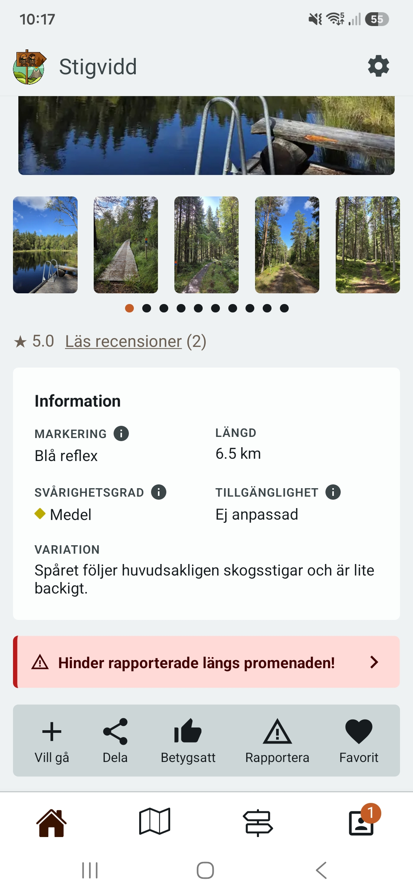
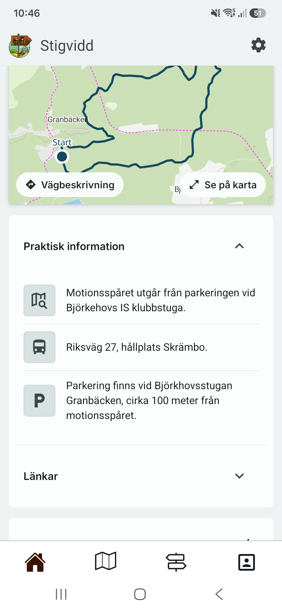
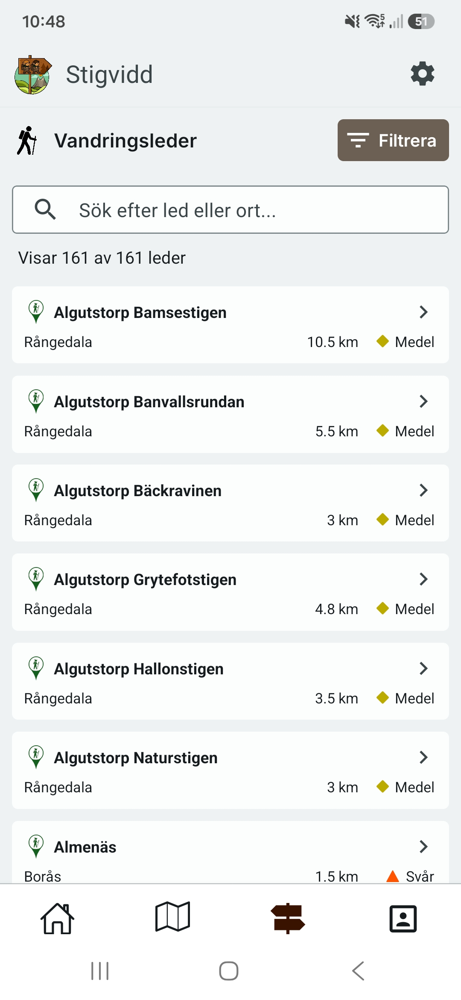
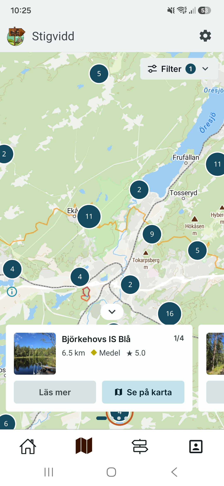
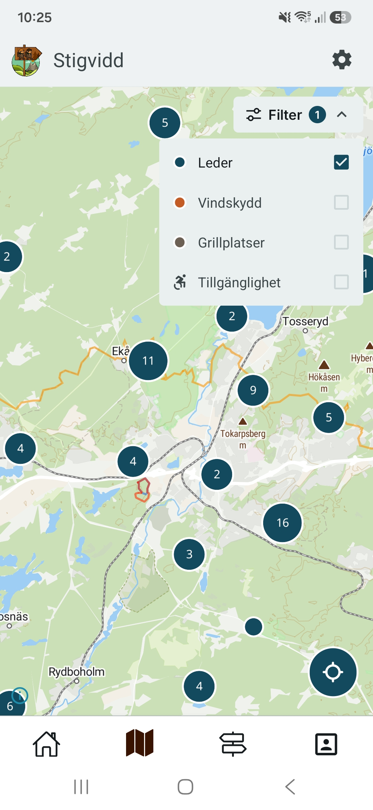

# Stigvidd

Stigvidd is a full-stack hiking and trail discovery application built as a thesis project. It lets users explore hiking trails in the Borås area, record their own hikes with GPS tracking, rate and review trails, and report obstacles along the way.

The project consists of three parts: a cross-platform mobile app, a web-based admin dashboard, and a REST API backend.

<figure>
  
</figure>

---

## Screenshots

<table>
  <tr>
    <td align="center"><b>Login</b></td>
    <td align="center"><b>Start screen</b></td>
    <td align="center"><b>Profile</b></td>
    <td align="center"><b>Favorites</b></td>
  </tr>
  <tr>
    <td></td>
    <td></td>
    <td></td>
    <td></td>
  </tr>
  <tr>
    <td align="center"><b>Trail detail</b></td>
    <td align="center"><b>Trail info & obstacles</b></td>
    <td align="center"><b>Practical info</b></td>
    <td align="center"><b>Trail list</b></td>
  </tr>
  <tr>
    <td></td>
    <td></td>
    <td></td>
    <td></td>
  </tr>
  <tr>
    <td align="center"><b>Map overview</b></td>
    <td align="center"><b>Map filter</b></td>
    <td></td>
    <td></td>
  </tr>
  <tr>
    <td></td>
    <td></td>
    <td></td>
    <td></td>
  </tr>
</table>

---

## Architecture

```
stigvidd/
├── app/          # Mobile app (React Native / Expo)
├── web/          # Admin dashboard (React / Vite)
├── backend/      # REST API + domain logic (ASP.NET Core / C#)
│   ├── StigviddAPI/        # Controllers, middleware, startup
│   ├── Core/               # Services, validators, factories
│   ├── Infrastructure/     # EF Core entities, DbContext, migrations
│   ├── WebDataContracts/   # Request/response DTOs
│   ├── MapData/            # GeoJSON/CSV import ETL tool (see below)
│   └── Tests/              # Unit and integration tests
```

---

## Tech Stack

### Mobile App

- React Native with Expo (SDK 54)
- TypeScript
- Expo Router (file-based routing)
- MapLibre Native + MapTiler "Outdoor" vector tiles, with Expo Location (GPS tracking)
- TanStack Query (server state) + Jotai (global state)
- React Hook Form + Zod (form validation)
- React Native Paper (Material Design 3)
- Expo Notifications (push notifications)
- i18next / react-i18next (Swedish + English, in progress — not yet user-facing)

### Admin Dashboard

- React 19 with Vite
- TypeScript
- React Router v7
- Tailwind CSS v4
- Keycloak (JWT / OpenID Connect)

### Backend

- ASP.NET Core 10 (Web API)
- C# / .NET 10
- Entity Framework Core 10 with PostgreSQL + PostGIS
- Keycloak (JWT / OpenID Connect)
- FluentValidation with auto-validation middleware
- WebDAV for image file storage
- NSwag / Swagger for API docs
- OpenTelemetry → self-hosted OpenObserve (logs, traces, metrics, RUM)

---

## Features

- Browse and filter hiking trails (difficulty, accessibility, length, distance, city)
- Interactive map with trail markers and GPS coordinates
- Background GPS tracking during hikes with distance calculation
- Trail reviews with star ratings and photos
- Favorites and wishlist with optimistic UI updates
- Report trail obstacles/hazards with a voting system
- Share completed hikes with other users
- Push notifications
- User profiles with hike history
- Admin dashboard for trail management

> **In progress:** Swedish/English language support (i18n) is being built but not yet user-facing.

---

## MapData – Import Tool

`backend/MapData` is a C# console application that imports geographic data from Borås municipality's open data portal into the database. It contains two separate ETL (Extract, Transform, Load) parsers:

- **`TransmogrifyBorasData`** — imports trail data from a GeoJSON file (`spar_leder.json`)
- **`FacilityImporter`** — imports facility data (grill sites, wind shelters) from a CSV file

Both parsers:

1. **Extract** the source data from the municipality-provided file
2. **Transform** the data:
   - Parse Swedish property names and values (`"lätt"/"medel"/"svår"` → Classification enum)
   - Convert Swedish decimal format (`"2,3 km"` → decimal)
   - Swap GeoJSON coordinate order (`[longitude, latitude]` → `{latitude, longitude}`)
   - Map accessibility values (`"JA"/"NEJ"` → bool)
   - Handle missing and null fields gracefully
3. **Load** the transformed entities into PostgreSQL (PostGIS) via Entity Framework Core

To run an import, place the source file in the expected path and run the `MapData` project. Connection string is configured via .NET user secrets.

---

## Getting Started

### Prerequisites

- Node.js 20+
- .NET 10 SDK
- PostgreSQL with the PostGIS extension (local or remote)
- A Keycloak realm (for backend, mobile app and admin dashboard authentication)
- A MapTiler API key and style id (for map tiles in the mobile app)
- Expo Go app or Android/iOS emulator

---

### Backend

1. Navigate to the API project:

   ```bash
   cd backend/StigviddAPI
   ```

2. Set up user secrets with your connection string:

   ```bash
   dotnet user-secrets set "ConnectionStrings:StigVidd" "your_connection_string"
   ```

3. Configure your Keycloak realm settings (`Keycloak` and `KeycloakAdminClient` sections) in `appsettings.json` or user secrets.

4. Apply database migrations. EF Core commands run from `backend/` with `Infrastructure` as both
   project and startup project — `StigviddAPI` cannot be the startup project, since it does not
   reference `Microsoft.EntityFrameworkCore.Design`:

   ```bash
   cd ..
   dotnet tool restore
   dotnet user-secrets set "ConnectionStrings:StigVidd" "your_connection_string" --project Infrastructure
   dotnet ef database update --project Infrastructure --startup-project Infrastructure
   ```

   The connection string is set a second time here on purpose: `Infrastructure` and `StigviddAPI`
   have separate `UserSecretsId` values, and the design-time factory
   (`Infrastructure/Data/DesignTimeDbContextFactory.cs`) reads the former.

5. Run the API:
   ```bash
   cd StigviddAPI
   dotnet run
   ```

The API will be available at `https://localhost:7xxx`. Swagger UI is available at `/swagger`.

---

### Telemetry (optional)

The backend and the app both emit OpenTelemetry, but **only when it is
configured** — with the variables below unset, no exporter is registered, no SDK
is initialised, and nothing changes. To see your own traces and logs locally, run
the same OpenObserve image production uses:

```bash
docker run -d --name stigvidd-observatory \
  -p 5080:5080 -p 5081:5081 \
  -v stigvidd-observatory-dev:/data \
  -e ZO_DATA_DIR=/data \
  -e ZO_ROOT_USER_EMAIL=dev@stigvidd.se \
  -e 'ZO_ROOT_USER_PASSWORD=DevDev#123' \
  -e ZO_RUM_ENABLED=true \
  -e ZO_COMPACT_DATA_RETENTION_DAYS=3 \
  -e ZO_TELEMETRY=false \
  public.ecr.aws/zinclabs/openobserve:v0.92.2
```

UI at <http://localhost:5080>, same credentials. The password looks fussy because
OpenObserve enforces one: 8–128 characters with at least one lowercase, one
uppercase, one digit and one special character — a weaker value makes the
container *panic on startup* rather than warn.

Point the backend at it:

```bash
cd backend/StigviddAPI
dotnet user-secrets set "Otlp:Endpoint" "http://localhost:5080/api/default"
dotnet user-secrets set "Otlp:Username" "dev@stigvidd.se"
dotnet user-secrets set "Otlp:Password" "DevDev#123"
```

The endpoint takes **no signal path** — the exporter appends `/v1/logs`,
`/v1/traces` and `/v1/metrics` itself.

For the app, add your machine's **LAN IP** (not `localhost` — a phone or emulator
resolves that to itself) to `app/.env`, along with the RUM application id and
client token from *Ingestion → RUM* in the UI. Plain HTTP is dev-only: Android
blocks cleartext by default, and production is HTTPS through the proxy.

Tear down with `docker rm -f stigvidd-observatory` (add
`docker volume rm stigvidd-observatory-dev` to discard the data too).

**Before adding any instrumentation**, read
[docs/observability.md](docs/observability.md) — metrics must contain no personal
data, and GPS positions must never be logged. Those are hard constraints, not
style preferences.

---

### Mobile App

1. Navigate to the app directory:

   ```bash
   cd app
   ```

2. Install dependencies:

   ```bash
   npm install
   ```

3. Create a `.env` file with your API, Keycloak and MapTiler config:

   ```
   EXPO_PUBLIC_API_HOST=https://localhost:7xxx
   EXPO_PUBLIC_OIDC_URL=https://your-keycloak-host/auth
   EXPO_PUBLIC_OIDC_REALM=stigvidd
   EXPO_PUBLIC_CLIENT_ID=...
   EXPO_PUBLIC_MAPTILER_API_KEY=...
   EXPO_PUBLIC_MAPTILER_STYLE_ID=...

   # Telemetry (optional — omit and the app collects and sends nothing).
   # Ingest-only credentials from OpenObserve; see the Telemetry section above.
   # These ship inside the installed binary and are therefore PUBLIC: scope them
   # to a single stream, and never use the root account.
   EXPO_PUBLIC_OO_LOGS_URL=https://observatory.stigvidd.se/api/default/stigvidd_app_logs/_json
   EXPO_PUBLIC_OO_LOGS_TOKEN=...      # base64 of "<ingest-user>:<password>"
   EXPO_PUBLIC_LOG_LEVEL=debug
   ```

4. Start the development server:
   ```bash
   npx expo start
   ```

---

### Admin Dashboard

1. Navigate to the web directory:

   ```bash
   cd web
   ```

2. Install dependencies:

   ```bash
   npm install
   ```

3. Create a `.env` file with your Keycloak config:

   ```
   VITE_OIDC_URL=https://your-keycloak-host/auth
   VITE_OIDC_REALM=stigvidd
   VITE_CLIENT_ID=...
   ```

4. Start the development server:
   ```bash
   npm run dev
   ```

The API client under `src/api/generated` is generated by orval and must not be edited by hand.
After changing a backend contract, run the backend tests once — `OpenApiContractTests` rewrites
`web/openapi.json` and fails — then regenerate and commit both files:

```bash
npm run generate:api
```

CI runs the same command and fails if the committed client differs. Generation reads the committed
spec, so no backend needs to be running; set `ORVAL_API_URL` to
`http://localhost:5265/swagger/v1/swagger.json` to read from a live one instead.

---

## Authentication

Authentication is handled by Keycloak. The mobile app and admin dashboard obtain a JWT from Keycloak on login (OpenID Connect), which is passed as a Bearer token in API requests. The backend validates incoming tokens against the Keycloak realm via `AddKeycloakWebApiAuthentication`.

---

## Data Source

Trail and facility data (grill sites, wind shelters) for the Borås area is sourced from [Borås Stad's open data portal](https://www.boras.se) in GeoJSON/CSV format and imported using the `MapData` ETL tool.

---

## Licence

Stigvidd is free software. It is **not** under a single licence, because the two halves ship
through different channels and one of those channels will not accept copyleft of the strongest
kind.

| Part | Licence | |
| --- | --- | --- |
| `backend/` — REST API | **AGPL-3.0-or-later** | [text](LICENSES/AGPL-3.0-or-later.txt) |
| `web/` — admin dashboard | **AGPL-3.0-or-later** | [text](LICENSES/AGPL-3.0-or-later.txt) |
| `app/` — mobile app (Android + iOS) | **MPL-2.0**, Exhibit B not applied | [text](LICENSES/MPL-2.0.txt) · [why](app/LICENSE.md) |

Every file says which of the two it is under, as an `SPDX-License-Identifier` header. Files
that cannot carry one — generated code, EF migrations, binaries — are covered by
[`REUSE.toml`](REUSE.toml). The repository follows the
[REUSE](https://reuse.software) specification, and CI checks that it still does.

### The backend and admin web are AGPL

They are two halves of one network service, which is exactly the case the GNU Affero GPL
exists for: ordinary GPL copyleft reaches people you hand a binary to, and a hosted service
hands out no binaries. AGPL § 13 closes that.

### The app is MPL-2.0, and keeps the GPL option open

Android and iOS are built from one codebase, so the licence has to satisfy the stricter store.
Apple's App Store terms impose DRM and per-account device limits, which GPLv3/AGPLv3 § 6
forbids imposing on a recipient — the conflict that pushed VLC's iOS port off the GPL.

MPL-2.0 is compatible with store distribution. Crucially, **Exhibit B is deliberately not
applied**, so the Secondary Licenses in MPL-2.0 § 1.12 stay available: anyone who wants this
code under GPL-2.0-or-later, LGPL-2.1-or-later or AGPL-3.0-or-later may take it on those terms
instead. See [`app/LICENSE.md`](app/LICENSE.md) — and do not add an Exhibit B notice.

### Source for the running service

AGPL § 13 entitles everyone who interacts with a deployed Stigvidd server to its Corresponding
Source. This repository is that source: <https://github.com/themalind/stigvidd>. The admin
dashboard and the mobile app both link to it from their About screens, and the API advertises
it in its OpenAPI description.

### Third-party components

Dependencies keep their own licences, listed in
[`backend/THIRD-PARTY-NOTICES.md`](backend/THIRD-PARTY-NOTICES.md),
[`web/THIRD-PARTY-NOTICES.md`](web/THIRD-PARTY-NOTICES.md) and
[`app/THIRD-PARTY-NOTICES.md`](app/THIRD-PARTY-NOTICES.md). Nothing in the tree is non-free.

Map data is OpenStreetMap under **ODbL 1.0**, served by MapTiler; the attribution is rendered
on every map screen and is not optional. Trail and facility data comes from Borås Stad's open
data portal under **CC0 1.0**, a public domain dedication that requires no attribution — the
credit given to Borås Stad is a courtesy, and only the ODbL one is an obligation.

Copyright © 2025-2026 The Stigvidd Authors. The individual copyright holders are listed
in [`AUTHORS`](AUTHORS) — relicensing any part of this project needs the agreement of all
of them, since there is no CLA and no copyright assignment.
